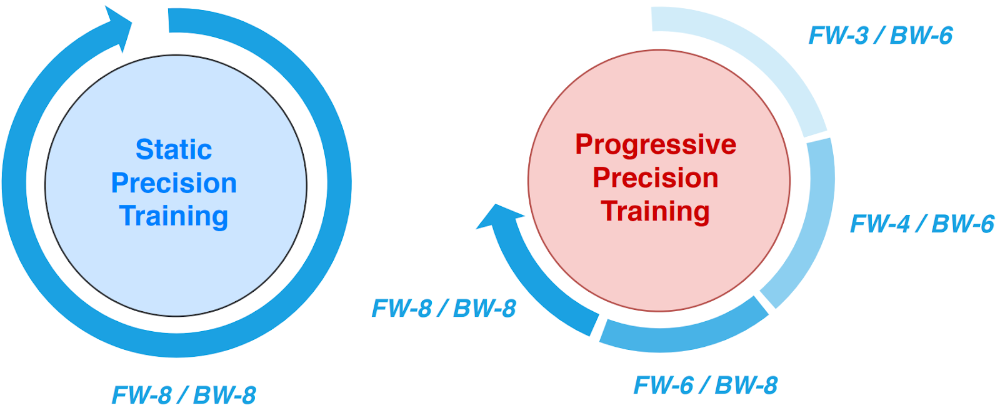
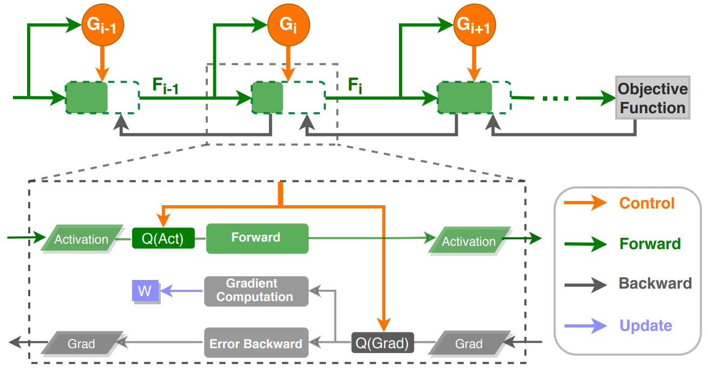
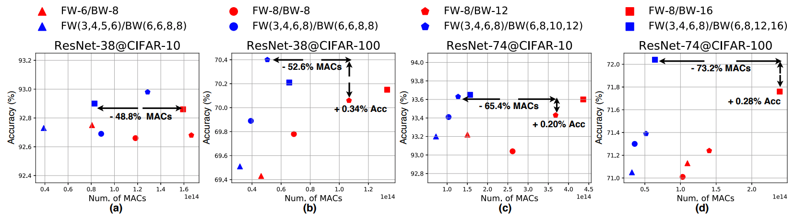
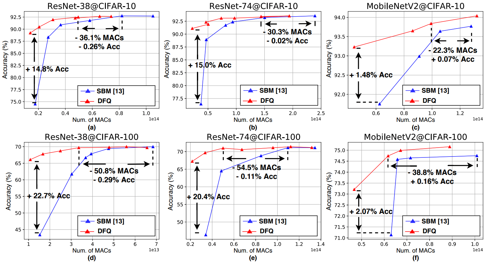
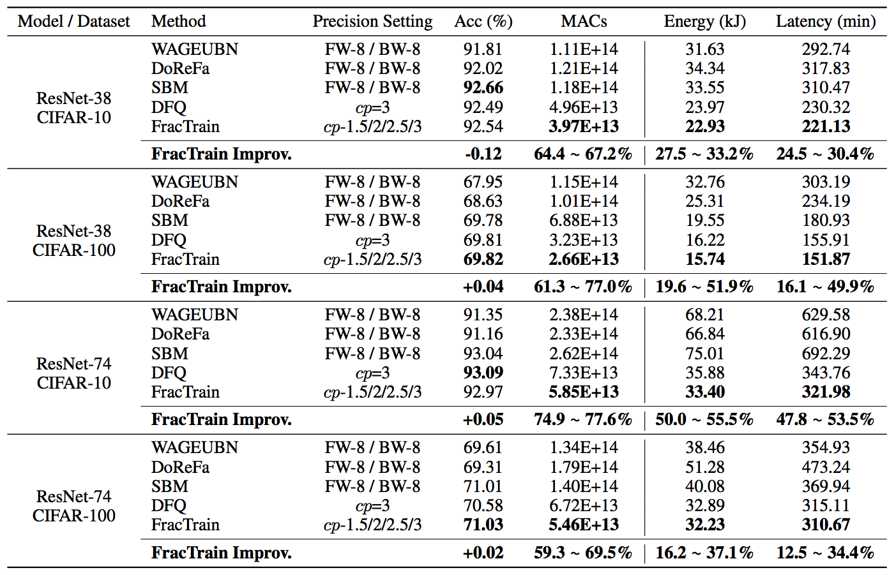
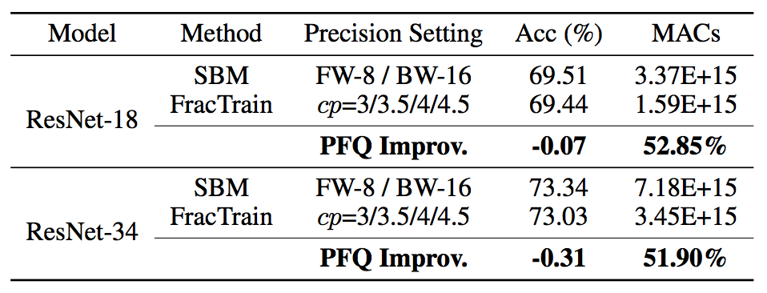

# FracTrain: Fractionally Squeezing Bit Savings Both Temporally and Spatially for Efficient DNN Training
***Yonggan Fu***, Haoran You, Yang Zhao, Yue Wang, Chaojian Li, Kailash Gopalakrishnan, Zhangyang Wang, Yingyan Lin

Accepted at NeurIPS 2020 [[Paper Link]](https://papers.nips.cc/paper/2020/file/8dc5983b8c4ef1d8fcd5f325f9a65511-Paper.pdf).

## Overview
As reducing precision is one of the most effective knobs for boosting DNN training time/energy efficiency, there has been a growing interest in low-precision DNN
training. In this paper, we propose the ***FracTrain*** framework which explores from an orthogonal direction: how to fractionally squeeze out more training cost savings from the most redundant bit level, progressively along the training trajectory and dynamically per input.


## Method
We propose ***FracTrain*** that integrates *(i)* progressive fractional quantization (PFQ) which gradually increases the precision of activations, weights, and gradients that will not reach the precision of SOTA static quantized DNN training until the final training stage, and *(ii)* dynamic fractional quantization (DFQ) which assigns precisions to both the activations and gradients of each layer in an input-adaptive manner, for only “fractionally” updating layer parameters.

### Progressive Fractional Quantization (PFQ)

<p align="center">
  
</p>

PFQ progressively increases the precision for both forward and backward in DNN training controlled by an automated indicator, which gradually switches the focus from solution space exploration enabled by low precision to accurate update for better convergence enabled by high precision.

### Dynamic Fractional Quantization (DFQ)

<p align="center">
  
</p>

DFQ dynamically selects the precision for each layer’s activation and gradient during training in an input-adaptive manner controlled by a lightweight LSTM-based gate function.

### The FracTrain framework

***FracTrain*** integrates PFQ and DFQ in an easy but effective way that it applies PFQ’s indicator to schedule DFQ's compression ratio in different training stages.


## Evaluation
We evaluate ***FracTrain*** on six models & four datasets (i.e., ResNet-38/74/MobileNetV2 on CIFAR-10/100, ResNet-18/34 on ImageNet, and Transformer on WikiText-103). Here are some representative experiments and please refer to [our paper](https://papers.nips.cc/paper/2020/file/8dc5983b8c4ef1d8fcd5f325f9a65511-Paper.pdf) for more results.


### Evaluating PFQ

<p align="center">
  
</p>


### Evaluating DFQ


<p align="center">
  
</p>


### Evaluating FracTrain integrating PFQ and DFQ

- ***FracTrain*** on CIFAR-10/100
<p align="center">
  
</p>


- ***FracTrain*** on ImageNet
<p align="center">
  
</p>


## Code Usage
Our code is inspired by [SkipNet](https://github.com/ucbdrive/skipnet) and we follow its training setting for CIFAR-10/100 and ImageNet.

### Prerequisites
See `env.yml` for the complete conda environment. Create a new conda environment:
```
conda env create -f env.yml
conda activate pytorch
```

### Overview
`fractrain_cifar` and `fractrain_imagenet` are the codes customized for CIFAR-10/100 and ImageNet, respectively, with a similar code structure. In particular, `train_pfq.py`, `train_dfq.py`, and `train_frac.py` are the training scripts for training the target network with PFQ, DFQ, and ***FracTrain***, respectively. 
Here we use `fractrain_cifar` to demo the commands for training.

### Training with PFQ
In addition to the commonly considered args, e.g., the target network, dataset, and data path via `--arch`, `--dataset`, and `--datadir`, respectively, you also need to: (1) Specify the precision schedule for both forward and backward with `--num_bits_schedule` and `--num_grad_bits_schedule`, respectively; (2) Specify the epsilon and alpha in Alg.1 of [our paper](https://papers.nips.cc/paper/2020/file/8dc5983b8c4ef1d8fcd5f325f9a65511-Paper.pdf) with `--initial_threshold` and `--decay`, respectively, as well as the number of turning points via `--num_turning_point`.

- Example: Training ResNet-74 on CIFAR-100 with PFQ
```
cd fractrain_cifar
python train_pfq.py --save_folder ./logs/ --arch cifar100_resnet_74 --workers 4 --dataset cifar100 --datadir path-to-cifar100 --num_bits_schedule 3 4 6 8 --num_grad_bits_schedule 6 6 8 8 --num_turning_point 3 --initial_threshold 0.05 --decay 0.3
```

### Training with DFQ
Specify the weight precision with `--weight_bits` and the target *cp* as defined in Sec. 3.2 of [our paper](https://papers.nips.cc/paper/2020/file/8dc5983b8c4ef1d8fcd5f325f9a65511-Paper.pdf) with `--target_ratio`.

- Example: Training ResNet-74 on CIFAR-100 with DFQ
```
cd fractrain_cifar
python train_dp.py --save_folder ./logs --arch cifar100_rnn_gate_74 --workers 4 --dataset cifar100 --datadir path-to-cifar100 --weight_bits 4 --target_ratio 3
```

### Training with FracTrain
Specify the step (increment) of *cp* between two consective training stages with `--target_ratio_step` and other args follow the ones in PFQ and DFQ.

- Example: Training ResNet-74 on CIFAR-100 with ***FracTrain***
```
cd fractrain_cifar
python train_frac.py --save_folder ./logs --arch cifar100_rnn_gate_74 --workers 4 --dataset cifar100 --datadir path-to-cifar100 --weight_bits 4 --target_ratio 1.5 --target_ratio_step 0.5  --initial_threshold 0.05 --decay 0.3
```

Similarly, for training on ImageNet:

- Example: Training ResNet-18 on ImageNet with ***FracTrain***

```
cd fractrain_imagenet
python train_frac.py --save_folder ./logs --arch resnet18_rnn --workers 32 --dataset imagenet --datadir path-to-imagenet --weight_bits 6 --target_ratio 3 --target_ratio_step 0.5  --initial_threshold 0.05 --decay 0.3 
```


## Citation
```
@article{fu2020fractrain,
  title={FracTrain: Fractionally Squeezing Bit Savings Both Temporally and Spatially for Efficient DNN Training},
  author={Fu, Yonggan and You, Haoran and Zhao, Yang and Wang, Yue and Li, Chaojian and Gopalakrishnan, Kailash and Wang, Zhangyang and Lin, Yingyan},
  journal={Advances in Neural Information Processing Systems},
  volume={33},
  year={2020}
}
```
